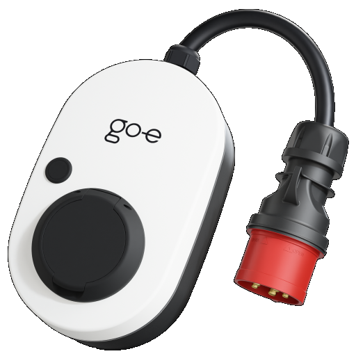

# ioBroker.go-eCharger

## Versions

## Adapter for reading go-eCharger data for iOBroker
Adapter for reading go-eCharger data. Adapter creates some states and updates sequentially. Adapter is connectable to PV-system to make use of surplus solar power for charging your car. Working with firmware V033, V040.0, V041.0, V054.7, V054.11, V055.5, V055.7, V055.8, V56.1.

For use with hardware generation 3 & 4 you have to enable "HTTP API v1" in your go-e api.
For use with phase switching you need hardware generation 3 or 4 and additionally you have to enable "HTTP API v2" in your go-e api.

### Settings
To connect to the go-eCharger type in its IP-address in the config.

## Notes
This adapter uses Sentry libraries to automatically report exceptions and code errors to the developers. For more details and for informations on how to disable the error reporting see [Sentry-Plugin Documentation](https://github.com/ioBroker/plugin-sentry#plugin-sentry)! Sentry reporting is used starting with js-controller 3.0.

## Changelog

### 0.19.2 (03.08.2024)

- (HombachC) added support for firmware V56.2

### 0.19.1 (11.06.2024)

- (HombachC) fixed known vulnerability in dependency

### 0.19.0 (30.05.2024)

- (HombachC) intruduced possibility to not subtract charger power from homeconsumption

### 0.18.1 (28.05.2024)

- (HombachC) change test procedure to ioBroker standard
- (HombachC) revert eslint to 8.57
- (HombachC) add info.connection state (#564)
- (HombachC) add node 21 tests
- (HombachC) handle not reachable chargers (#563)

### 0.18.0 (19.04.2024)

- (HombachC) BREAKING: dropped support for node.js 16 (#558)
- (HombachC) BREAKING: js-controller >= 5 is required (#559)
- (HombachC) updated adapter-core to 3.1.4

### 0.17.5 (27.03.2024)

- (HombachC) smaller logo
- (HombachC) corrected io-package.json according to new schema

### 0.17.4 (27.03.2024)

- (HombachC) added support for firmware V56.1

### 0.17.3 (27.03.2024)

- (HombachC) Update github workflows
- (HombachC) update adapter-core to 3.0.6

### 0.17.2 (16.01.2024)

- (HombachC) Fix error in calling API V2 on old HW

### 0.17.1 (10.01.2024)

- (HombachC) Fix phases calculation error (#533)

### 0.17.0 (10.01.2024)

- (HombachC) BREAKING: dropped support for js-controller 3.x
- (HombachC) Implement API V2 to get and switch charging phases
- (HombachC) optimized sentry logging

### 0.16.3 (23.12.2023)

- (HombachC) add support for V055.8
- (HombachC) year 2024 changes

### 0.16.2 (19.11.2023)

- (HombachC) add support for V055.5 & V055.7
- (HombachC) Change Sentry logging to new project

### 0.16.1 (19.11.2023)

- (HombachC) Add support for V054.11

### 0.16.0 (18.11.2023)

- (HombachC) replaced got by axios

### Old Changes see [CHANGELOG OLD](CHANGELOG_OLD.md)

## License
MIT License

Copyright (c) 2020 - 2024 HombachC

Permission is hereby granted, free of charge, to any person obtaining a copy
of this software and associated documentation files (the "Software"), to deal
in the Software without restriction, including without limitation the rights
to use, copy, modify, merge, publish, distribute, sublicense, and/or sell
copies of the Software, and to permit persons to whom the Software is
furnished to do so, subject to the following conditions:

The above copyright notice and this permission notice shall be included in all
copies or substantial portions of the Software.

THE SOFTWARE IS PROVIDED "AS IS", WITHOUT WARRANTY OF ANY KIND, EXPRESS OR
IMPLIED, INCLUDING BUT NOT LIMITED TO THE WARRANTIES OF MERCHANTABILITY,
FITNESS FOR A PARTICULAR PURPOSE AND NONINFRINGEMENT. IN NO EVENT SHALL THE
AUTHORS OR COPYRIGHT HOLDERS BE LIABLE FOR ANY CLAIM, DAMAGES OR OTHER
LIABILITY, WHETHER IN AN ACTION OF CONTRACT, TORT OR OTHERWISE, ARISING FROM,
OUT OF OR IN CONNECTION WITH THE SOFTWARE OR THE USE OR OTHER DEALINGS IN THE
SOFTWARE.
